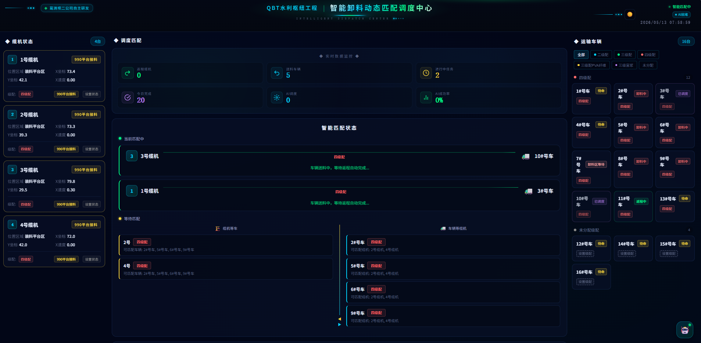
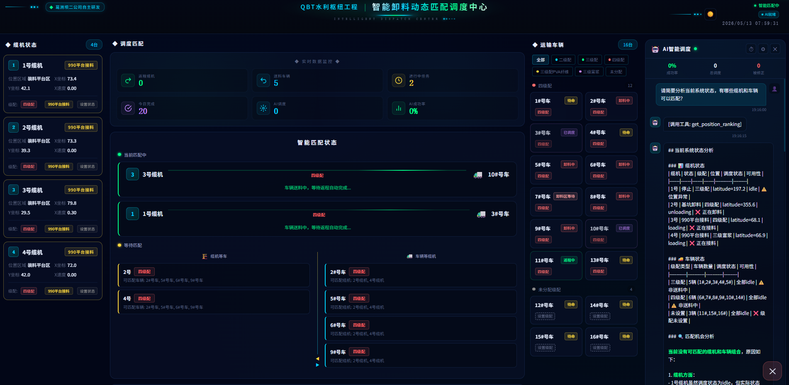
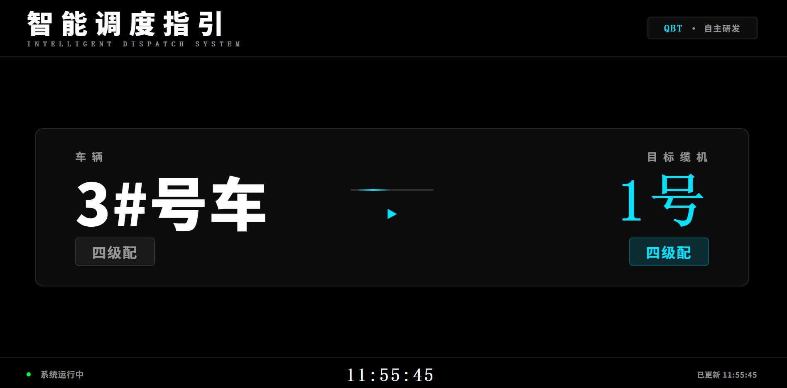

# 智能卸料动态匹配调度系统

一个面向缆机协同作业的智能卸料动态匹配调度系统，用于水利枢纽工程中缆机与运输车辆的智能调度匹配。

## 项目背景

在水利枢纽工程施工中，缆机与混凝土运输车辆的调度是一个复杂且关键的问题。传统的调度方式主要依赖人工经验，面临以下挑战：

### 核心难点

1. **复杂的级配关系管理**
   - 不同车辆运输的混凝土具有不同的级配（标号）要求
   - 每台缆机也有其对应的级配处理能力
   - 智能调度必须确保：特定级配的混凝土车辆匹配到对应级配的缆机

2. **实时位置关系处理**
   - 车辆与缆机的位置状态实时变化
   - 需要基于两者的实时位置进行动态关联分析
   - 考虑车辆到达时间、缆机作业状态等因素

3. **人机协同调度融合**
   - 智能调度结果需要与人工调度无缝配合
   - 调度员可通过系统界面查看智能推荐，也可通过对讲机人工干预
   - 司机通过车载终端接收调度指令，同时可接受人工指令

### 解决方案

本系统通过以下方式解决上述问题：

- **双维度匹配机制**：同时考虑位置状态和级配信息进行智能匹配
- **实时状态感知**：自动监测缆机和车辆的位置、状态变化
- **人机融合设计**：
  - 智能匹配结果实时推送到司机车载终端
  - 调度员可随时人工干预和纠正
  - 当车辆位置状态与匹配状态相反时，自动结束调度任务
  - 实现人工调度与智能调度的完美融合，互不冲突

## 项目简介

本项目是一个基于 Vue 3 + Flask 的智能调度系统，主要功能包括：

- **缆机状态监控**：实时监控缆机的位置、状态、料位等信息
- **车辆调度管理**：管理运输车辆的状态、位置、匹配情况
- **智能匹配算法**：基于 AI 的智能调度算法，实现缆机与车辆的最优匹配
- **AI 智能调度助手**：集成 AI 助手，提供智能调度建议和状态分析

## 技术栈

### 后端
- Python 3.x
- Flask 3.0.0
- PyMySQL 1.1.0
- OpenAI API

### 前端
- Vue 3.4.15
- TypeScript
- Vite 5.0.11
- Pinia 状态管理
- Axios

## 项目结构

```
.
├── dispatch_center/          # Flask 后端
│   ├── app.py               # 主应用入口
│   ├── ai_engine.py         # AI 调度引擎
│   ├── ai_scheduler.py      # AI 调度器
│   ├── database.py          # 数据库操作
│   ├── data_sync.py         # 数据同步
│   ├── static/              # 静态资源
│   └── templates/           # HTML 模板
├── vue-frontend/            # Vue 前端
│   ├── src/
│   │   ├── components/      # 组件
│   │   ├── stores/          # Pinia 状态管理
│   │   ├── api/             # API 接口
│   │   └── types/           # TypeScript 类型定义
│   └── package.json
├── screenshots/             # 项目截图
├── requirements.txt         # Python 依赖
└── README.md
```

## 功能截图

### 调度中心主界面
调度中心大屏展示所有缆机和车辆的实时状态、智能匹配结果，支持调度员进行全局监控和人工干预。



### AI 智能调度助手
集成 AI 助手，实时分析系统状态，提供智能调度建议和决策支持。



### 司机端大屏
司机通过车载终端接收调度指令，清晰显示目标缆机、混凝土级配信息，实现人机协同作业。



## 安装与运行

### 后端部署

1. 安装依赖
```bash
pip install -r requirements.txt
```

2. 配置数据库
修改 `config.py` 中的数据库连接信息

3. 启动服务
```bash
python dispatch_center/app.py
```

### 前端开发

1. 进入前端目录
```bash
cd vue-frontend
```

2. 安装依赖
```bash
npm install
```

3. 启动开发服务器
```bash
npm run dev
```

4. 构建生产版本
```bash
npm run build
```

## 许可证

MIT License
